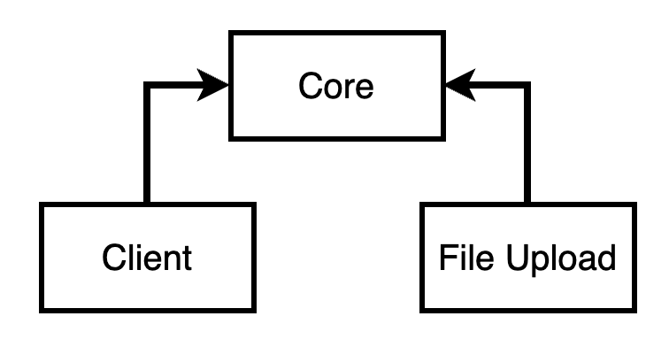
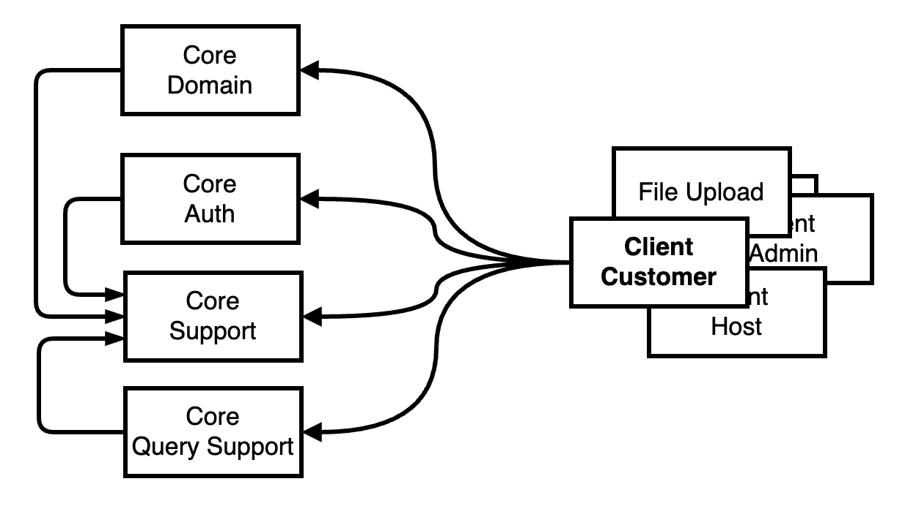

# 🏨 호텔 예약 플랫폼 (Hotel Reservation Platform)

> Java/Spring 기반의 숙소 예약 플랫폼 백엔드 프로젝트입니다.  
> 고객, 업체(호스트), 관리자 세 가지 사용자 유형에 맞춘 멀티 모듈 아키텍처를 설계하고,  
**도메인 중심 설계와 인증/인가 기능, 대용량 Batch 설계, PG 연동을 통한 결제 프로세스 구현 등 등** 실전 감각을 기르기 위한 사이드 프로젝트입니다.

 

## 🛠️ 기술 스택

- Java 21
- Spring Boot, Spring Batch, Spring Security
- JPA, MySQL
- Redis, JWT
- Gradle (멀티 모듈)
- Docker
- QueryDSL

---

## 🔗주요 아티클

### Batch 설계 관련

- [매일 수백만 건의 예약 가능 객실, 어떻게 만들까? - 객실 가용성 배치 도입기](https://pablo7.tistory.com/entry/Batch-%EC%8B%9C%EB%A6%AC%EC%A6%88-1-%EB%A7%A4%EC%9D%BC-%EC%88%98%EB%B0%B1%EB%A7%8C-%EA%B1%B4%EC%9D%98-%EC%98%88%EC%95%BD-%EA%B0%80%EB%8A%A5-%EA%B0%9D%EC%8B%A4-%EC%96%B4%EB%96%BB%EA%B2%8C-%EB%A7%8C%EB%93%A4%EA%B9%8C-%EA%B0%9D%EC%8B%A4-%EA%B0%80%EC%9A%A9%EC%84%B1-%EB%B0%B0%EC%B9%98-%EB%8F%84%EC%9E%85%EA%B8%B0)
- [Chunk vs Tasklet, 상황에 맞는 최적의 도구는?](https://pablo7.tistory.com/entry/Batch-%EC%8B%9C%EB%A6%AC%EC%A6%88-2-Chunk-%EB%B0%A9%EC%8B%9D-%EC%95%84%EB%8B%88-Tasklet%EC%9C%BC%EB%A1%9C-%EA%B0%84%EB%8B%A4)
- [성능 측정과 병목점 찾기: Tasklet의 한계, 그리고 Processor 최적화](https://pablo7.tistory.com/entry/Batch-%EC%8B%9C%EB%A6%AC%EC%A6%88-3-%EC%84%B1%EB%8A%A5-%EC%B8%A1%EC%A0%95%EA%B3%BC-%EB%B3%91%EB%AA%A9%EC%A0%90-%EC%B0%BE%EA%B8%B0-Tasklet%EC%9D%98-%ED%95%9C%EA%B3%84-%EA%B7%B8%EB%A6%AC%EA%B3%A0-Processor-%EC%B5%9C%EC%A0%81%ED%99%94)
- [Insert 성능 최적화: PreparedStatement, 그리고 클러스터드 인덱스의 함정](https://pablo7.tistory.com/entry/Batch-%EC%8B%9C%EB%A6%AC%EC%A6%88-4-DB-Insert-%EC%84%B1%EB%8A%A5-%EA%B0%9C%EC%84%A0-PreparedStatement-%EA%B7%B8%EB%A6%AC%EA%B3%A0-%ED%8A%B8%EB%9E%9C%EC%9E%AD%EC%85%98%EA%B3%BC-Lock-%EC%9E%91%EC%84%B1-%EC%A4%91)
- [클러스터드 인덱스를 넘어서: PK 실험과 LOAD DATA INFILE의 만남](https://pablo7.tistory.com/entry/Batch-%EC%8B%9C%EB%A6%AC%EC%A6%88-5-PK-%EC%9E%AC%EC%84%A4%EA%B3%84-%ED%81%B4%EB%9F%AC%EC%8A%A4%ED%84%B0%EB%93%9C-%EC%9D%B8%EB%8D%B1%EC%8A%A4%EC%99%80%EC%9D%98-%EB%8F%99%ED%96%89)
- [MySQL 옵션 튜닝의 실패, 구조를 향한 시작](https://pablo7.tistory.com/entry/Batch-%EC%8B%9C%EB%A6%AC%EC%A6%88-6-MySQL-%EC%98%B5%EC%85%98-%ED%8A%9C%EB%8B%9D%EC%9D%98-%EC%8B%A4%ED%8C%A8-%EA%B5%AC%EC%A1%B0%EB%A5%BC-%ED%96%A5%ED%95%9C-%EC%8B%9C%EC%9E%91)
- [MySQL 튜닝 재도전: 구조적 이해로 옵션을 바라보기](https://pablo7.tistory.com/entry/Batch-%EC%8B%9C%EB%A6%AC%EC%A6%88-7-MySQL-%ED%8A%9C%EB%8B%9D-%EC%9E%AC%EB%8F%84%EC%A0%84-%EA%B5%AC%EC%A1%B0%EC%A0%81-%EC%9D%B4%ED%95%B4%EB%A1%9C-OLAPOLTP-%EA%B7%A0%ED%98%95-%EC%B0%BE%EA%B8%B0)
- [연박 정책 기반 집계 구조: 성능 병목을 해결하기 위한 데이터 리모델링](https://pablo7.tistory.com/entry/Batch-%EC%8B%9C%EB%A6%AC%EC%A6%88-8-%EC%97%B0%EB%B0%95-%EC%A0%95%EC%B1%85-%EA%B8%B0%EB%B0%98-%EC%A7%91%EA%B3%84-%EA%B5%AC%EC%A1%B0-%EC%84%B1%EB%8A%A5-%EB%B3%91%EB%AA%A9%EC%9D%84-%ED%95%B4%EA%B2%B0%ED%95%98%EA%B8%B0-%EC%9C%84%ED%95%9C-%EB%8D%B0%EC%9D%B4%ED%84%B0-%EB%A6%AC%EB%AA%A8%EB%8D%B8%EB%A7%81)

### JPA/QueryDSL 유틸 설계 관련

- [QueryDSL과 타입 안정성을 고려한 커서 설계기](https://pablo7.tistory.com/entry/%EC%82%AC%EC%9D%B4%EB%93%9C-%ED%94%84%EB%A1%9C%EC%A0%9D%ED%8A%B8-QueryDSL%EA%B3%BC-%ED%83%80%EC%9E%85-%EC%95%88%EC%A0%95%EC%84%B1%EC%9D%84-%EA%B3%A0%EB%A0%A4%ED%95%9C-%EC%BB%A4%EC%84%9C-%EC%84%A4%EA%B3%84%EA%B8%B0)
- [JPA Pagable 변환 유틸 설계기](https://pablo7.tistory.com/entry/%EC%82%AC%EC%9D%B4%EB%93%9C-%ED%94%84%EB%A1%9C%EC%A0%9D%ED%8A%B8-%EC%A0%95%EB%A0%AC-%ED%95%98%EB%82%98%EC%97%90%EB%8F%84-%EC%84%A4%EA%B3%84%EA%B0%80-%EB%93%A4%EC%96%B4%EA%B0%84%EB%8B%A4)

### 기술에 대한 고찰

- [객체 생성에 관한 고찰](https://pablo7.tistory.com/entry/%EA%B0%9D%EC%B2%B4-%EC%83%9D%EC%84%B1%EC%97%90-%EA%B4%80%ED%95%B4)
- [필요한 기능만 의존하게 하자 (Feat: ISP)](https://pablo7.tistory.com/entry/%EA%B3%A0%EC%B0%B0%ED%95%98%EA%B8%B0-%ED%95%84%EC%9A%94%ED%95%9C-%EA%B8%B0%EB%8A%A5%EB%A7%8C-%EC%9D%98%EC%A1%B4%ED%95%98%EA%B2%8C-%ED%95%98%EC%9E%90)
- [Lock 전략을 결정하는 건 기술이 아니라 도메인이다](https://pablo7.tistory.com/entry/%EA%B3%A0%EC%B0%B0%ED%95%98%EA%B8%B0-Lock-%EC%A0%84%EB%9E%B5%EC%9D%84-%EA%B2%B0%EC%A0%95%ED%95%98%EB%8A%94-%EA%B1%B4-%EA%B8%B0%EC%88%A0%EC%9D%B4-%EC%95%84%EB%8B%88%EB%9D%BC-%EB%8F%84%EB%A9%94%EC%9D%B8%EC%9D%B4%EB%8B%A4)
- [Redis는 TTL 때문에 쓰면 과한가?](https://pablo7.tistory.com/entry/%EC%82%AC%EC%9D%B4%EB%93%9C-%ED%94%84%EB%A1%9C%EC%A0%9D%ED%8A%B8-Redis%EB%8A%94-TTL-%EB%95%8C%EB%AC%B8%EC%97%90-%EC%93%B0%EB%A9%B4-%EA%B3%BC%ED%95%9C%EA%B0%80)

## ✅ 구현 기능 요약

### 📌 아키텍처/인프라

- 멀티 모듈 설계 (core, client, batch, file-upload 등)
- [모듈 간 의존 역전 원칙 (core ↔ client 단방향)](https://github.com/f-lab-edu/hotel-reservation-platform/pull/69)
- [Docker 기반 개발/운영 환경 구성](https://github.com/f-lab-edu/hotel-reservation-platform/pull/35)

### 🔐 인증/인가

- [JWT 기반 인증](https://github.com/f-lab-edu/hotel-reservation-platform/pull/43)
- [Spring Security + 필터 체인 커스터마이징](https://github.com/f-lab-edu/hotel-reservation-platform/pull/64)
- [OAuth 기반 소셜 로그인 연동 구현 (Retry 및 CircuitBreaker 적용 )](https://github.com/f-lab-edu/hotel-reservation-platform/pull/66)

### 💳 예약 + 결제 흐름

- [예약 가계약 생성 구조 도입](https://github.com/f-lab-edu/hotel-reservation-platform/pull/87)
- [PG 연동을 통한 결제 프로세스 구현](https://github.com/f-lab-edu/hotel-reservation-platform/pull/89)

### ⚙️ Batch 처리

- [대용량 예약 가능 수량 적재 (Tasklet 기반)](https://github.com/f-lab-edu/hotel-reservation-platform/pull/76)
- [DB 성능 테스트 및 LOAD DATA INFILE 활용 Batch 구조 설계](https://github.com/f-lab-edu/hotel-reservation-platform/pull/81)
- [성능 튜닝: Redo Log, Buffer Pool, Checkpoint 최적화 실험](https://pablo7.tistory.com/entry/Batch-%EC%8B%9C%EB%A6%AC%EC%A6%88-7-MySQL-%ED%8A%9C%EB%8B%9D-%EC%9E%AC%EB%8F%84%EC%A0%84-%EA%B5%AC%EC%A1%B0%EC%A0%81-%EC%9D%B4%ED%95%B4%EB%A1%9C-OLAPOLTP-%EA%B7%A0%ED%98%95-%EC%B0%BE%EA%B8%B0)

### 🧠 트러블슈팅/실험 기반 개선

- [쿼리 성능 병목 추적(Batch 선집계 반영)](https://github.com/f-lab-edu/hotel-reservation-platform/pull/97)
- [동시성 고려 (Lock 전략, Redis RLock 등)](https://github.com/f-lab-edu/hotel-reservation-platform/pull/93)

## 🗺️ 모듈 설계

> “모듈은 기능이 아니라 **책임**으로 나눈다”를 원칙으로 설계했습니다.  
> `core ↔ client` 이중 계층을 통해 **공통 코드와 비즈니스 코드**를 물리적으로 격리합니다.

 

### 모듈 의존 관계도

#### Core <-> Client & File Upload

 

#### Core 모듈 내부

 

#### 전체 모듈 관계

 

### 1. 설계 원칙

| 원칙                   | 왜 필요한가?                                                              |
|----------------------|----------------------------------------------------------------------|
| 도메인 규칙과 저장소·프레임워크 분리 | 엔티티는 “데이터 구조”, 비즈니스 로직·정책은 클라이언트 모듈에서 책임 → 도메인을 필요 이상으로 오염시키지 않음 |
| core ↔ client 단방향 의존 | core 코드는 어떤 클라이언트도 몰라야 함. 클라이언트가 core를 호출하되, 역의존은 없음             |
| 클라이언트 독립 배포          | admin, host, customer, batch, file-upload는 각각 개별 애플리케이션으로 배포         |
| 쿼리 구현 책임 하행          | 실제 쿼리가 필요한 곳(=클라이언트)에서만 JPA, QueryDSL 활용하여 구현                        |

 

### 2. 각 모듈 책임

| 모듈                 | 역할 / 포함 내용                                                                                            |
|--------------------|-------------------------------------------------------------------------------------------------------|
| core-domain        | 주요 도메인, 공통 식별자(Entity)                                                                                |
| core-auth          | JWT AccessToken & RefreshToken 발급, JwtAuthenticationFilter , SecurityFilter, @LoginUserId, @LoginUser |
| core-support       | 요청/응답 로깅, 전역 응답(ApiResponse), 글로벌 예외, ErrorCode 등                                                     |      
| core-query-support | 공통 PageableUtils, 공통 CursorUtils                                                                      | 
| client-admin       | 내부 관리자 API (약관 관리)                                                                                    |    
| client-host        | 숙박업체 API (로그인, 숙소 정보, 객실 정보 관리)                                                                       |    
| client-customer    | 일반 고객 API (회원 가입, 인증 번호 발송, 로그인, 숙소 예약 등)                                                             | 
| client-batch(예정)   | 웹 트래픽과 무관한 ‘백오피스 작업자’ 역할                                                                              |
| file-upload        | 파일 업로드 전용 API (S3 Mock), 외부 노출용 단독 서비스                                                                |

 

### 3. 의존성 규칙

- core-* 모듈은 절대 다른 core 모듈 외에는 의존하지 않는다.
- client-* 는 필요한 core 모듈만 선택해 의존한다.

 

### 4. 개발 가이드

#### 📚 새 도메인 추가 절차

1. Entity → core-domain
2. 필요한 비즈니스 쿼리 → 해당 client- 모듈에서 Repository 구현
3. 공통 상수·Enum이 필요하면 core-support 에서 관리
