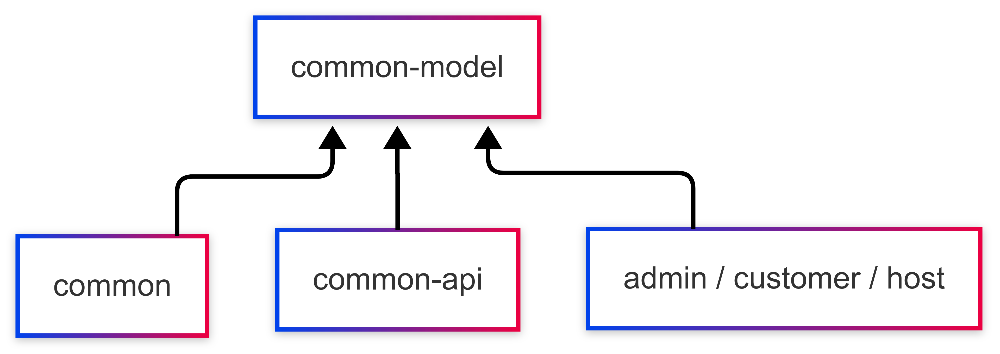
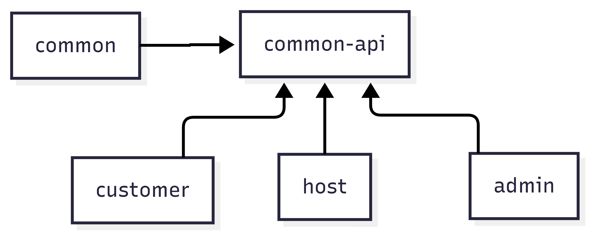
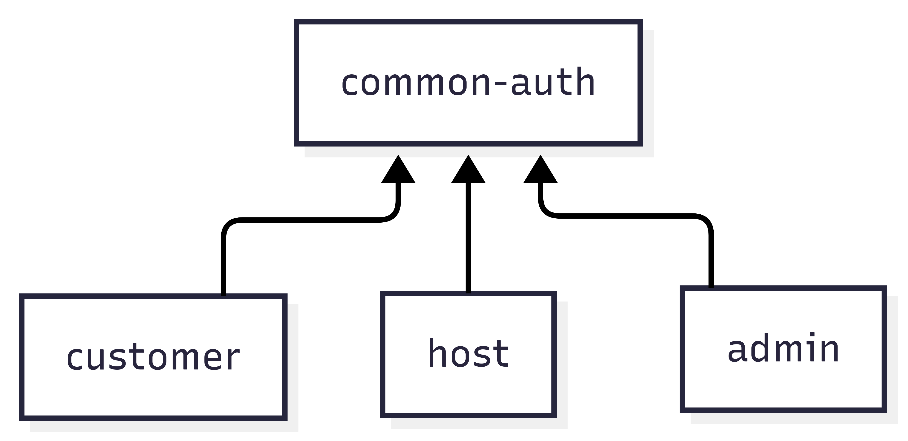

# 🏨 호텔 예약 플랫폼 (Hotel Reservation Platform)

> Java/Spring 기반의 숙소 예약 플랫폼 백엔드 프로젝트입니다.  
> 고객, 업체(호스트), 관리자 세 가지 사용자 유형에 맞춘 멀티 모듈 아키텍처를 설계하고,  
**도메인 중심 설계와 인증/인가 기능, 커서 기반 페이징 등** 실전 감각을 기르기 위한 사이드 프로젝트입니다.

<br />

## 🛠️ 기술 스택

- Java 21
- Spring Boot, Spring Security
- JPA, MySQL
- Redis, JWT
- Gradle (멀티 모듈)
- Docker
- QueryDSL

<br />

## 🧩 시스템 구성

```
📦 hotel-reservation-platform
├── common # 공통 기능 (예외, 응답 포맷, 인증 등)
├── common-api # 모듈별 기능 분리를 위한 인터페이스 정의
├── common-model # 의존성 최소화를 위한 공통 모델 정의
├── common-auth # JWT + Redis 인증 모듈
├── host # 숙박 업체용 API
├── admin # 관리자용 API
└── customer # 고객용 API
```



- 사용자 유형별 API 분리 & 공통 모듈 의존성 최소화



- 인증 모듈 또한 공통 모듈로 분리



- 하나의 DB를 공유하면서도 **모듈 간 의존성을 최소화**하는 구조 설계

<br />

## 💡 주요 기능 및 설계

### ✅ 1. 약관 도메인 설계 및 커서 기반 페이징

- 고객 대상 약관 동의 기능 구현
- 정렬 필드를 Enum + Generic 구조로 추상화하여 QueryDSL 기반 Keyset 페이징 지원

### ✅ 2. 회원가입 및 인증 / 인가

- 인증번호 발송 및 검증 (Redis TTL 기반)
- JWT Access/Refresh Token 발급 및 보안 처리
- `@LoginMember` ArgumentResolver 직접 구현하여 유저 컨텍스트 주입 처리

### ✅ 3. Security 커스터마이징

- JwtFilter 등록 및 인가 처리 로직 명확화
- 권한 기반 접근 제어 적용

<br />

## 🔗블로그

- Blog: [https://pablo7.tistory.com/](https://pablo7.tistory.com/)

---

## 📌 진행 상황

- ✅ 핵심 인증/인가 기능 구현 완료
- ✅ 약관 관리 기능 + Keyset 페이징 구현 완료
- ⏳ 숙소 등록 / 예약 / 결제 등 나머지 기능 구현 예정
- 🔄 커밋 이력 및 설계 과정은 GitHub + 블로그로 지속 기록 중입니다

---

## 🙋‍♂️ 프로젝트 목표

- 도메인 중심 아키텍처와 구조적 책임 분리를 직접 경험
- 사용자 유형에 따라 API를 분리하고, 공통 기능은 모듈화하여 의존 흐름을 명확하게 설계
- **대규모 트래픽을 고려한 실전 설계 훈련**
- **지속 가능한 설계 → 확장 가능한 코드**를 고민하며 성장 중입니다
